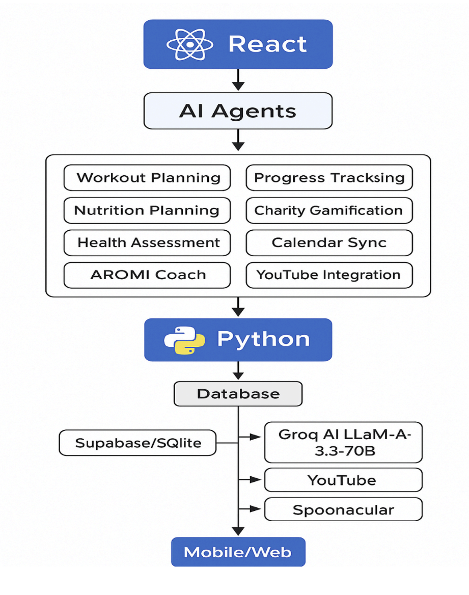

## Project Work Flow

### Milestone 1: Environment Setup and Project Initialization
| Activity | Description |
| :--- | :--- |
| **Activity 1.1** | Create and activate a Python virtual environment. |
| **Activity 1.2** | Set up project folder structure for backend and frontend. |
| **Activity 1.3** | Configure backend and frontend `.env` files with required API keys. |
| **Activity 1.4** | Install backend and frontend dependencies. |
| **Activity 1.5** | Run backend and frontend servers to verify setup. |

### Milestone 2: Backend API Development using FastAPI
| Activity | Description |
| :--- | :--- |
| **Activity 2.1** | Develop secure authentication endpoints for login and registration. |
| **Activity 2.2** | Create modular routers for all backend features. |
| **Activity 2.3** | Implement database models for workouts, nutrition, progress, and health. |
| **Activity 2.4** | Add service-layer logic for workout, nutrition, and analytics processing. |

### Milestone 3: AI Integration with Groq, YouTube, and External APIs
| Activity | Description |
| :--- | :--- |
| **Activity 3.1** | Integrate Groq LLaMA-3.3-70B for AI-generated plans and coaching. |
| **Activity 3.2** | Connect YouTube API for exercise video retrieval. |
| **Activity 3.3** | Integrate Spoonacular API for nutrition and recipe generation (Optional). |
| **Activity 3.4** | Implement Google Calendar API for workout schedule syncing (Optional). |
| **Activity 3.5** | Configure AROMI AI Coach for real-time adaptive support. |

### Milestone 4: React.js Frontend Development
| Activity | Description |
| :--- | :--- |
| **Activity 4.1** | Build responsive dashboard with user fitness insights. |
| **Activity 4.2** | Develop pages for workouts, nutrition, health assessment, and progress. |
| **Activity 4.3** | Implement AROMI AI floating assistant in frontend. |
| **Activity 4.4** | Integrate state management using Zustand and localStorage. |

### Milestone 5: Testing and Deployment
| Activity | Description |
| :--- | :--- |
| **Activity 5.1** | Perform backend API testing and validation. |
| **Activity 5.2** | Test frontend components and user interactions. |
| **Activity 5.3** | Test backend–frontend API integration with axios. |
| **Activity 5.4** | Conduct end-to-end user experience and output validation. |

---

## Project Structure


---

## Pre-requisites & Local Setup

| Step | Requirement | Action / Command |
| :--- | :--- | :--- |
| **1** | **Python Environment** | Install Python 3.10+ and create a virtual environment. |
| **2** | **Node.js Environment** | Install Node.js 18+ (includes npm 9+). |
| **3** | **Database Setup** | SQLite: Installed automatically during the first backend run. |
| **4** | **Backend Config** | Create `.env` inside `/backend` with required API keys. |
| **5** | **Frontend Config** | Create `.env` inside `/frontend` with `REACT_APP_API_URL=http://localhost:3000`. |
| **6** | **Backend Launch** | `venv\Scripts\activate`<br>`pip install -r requirements.txt`<br>`uvicorn main:app --reload` |
| **7** | **Frontend Launch** | `npm install`<br>`npm start` |
| **8** | **Verification** | **API Docs:** [http://127.0.0.1:8000/docs](http://127.0.0.1:8000/docs)<br>**Frontend:** [http://localhost:3000](http://localhost:3000) |

---

## External Services & Purpose

| Service | Where to Get | Purpose |
| :--- | :--- | :--- |
| **Groq** | [console.groq.com](https://console.groq.com) | AI brain (LLM processing) |
| **YouTube** | [Google Cloud Console](https://console.cloud.google.com) | Exercise video retrieval |
| **Spoonacular** | [spoonacular.com/food-api](https://spoonacular.com/food-api) | Recipe & Nutrition data (Optional) |
| **Google Calendar** | [Google Cloud Console](https://console.cloud.google.com) | Workout schedule synchronization (Optional) |

---

## How to Get Each API Key (Step-by-Step)

### 1️⃣ GROQ API KEY (Most Important!)
1. Go to 👉 [https://console.groq.com](https://console.groq.com)
2. Click **"Sign Up"** (use Google or email).
3. After login, click **"API Keys"** in the left sidebar.
4. Click **"Create API Key"**.
5. Give it a name like `ArogyaMitra`.
6. **Copy the key** (starts with `gsk_...`).
7. Paste it in your `.env` file:
   ```makefile
   GROQ_API_KEY=
   ```

### 2️⃣ YOUTUBE API KEY 
1. Go to 👉 [https://console.cloud.google.com](https://console.cloud.google.com)
2. Sign in with your Google account.
3. Click **"Select a Project"** → **"New Project"**.
4. Name it `ArogyaMitra` → Click **Create**.
5. In the search bar, type **"YouTube Data API v3"**.
6. Click on it → Click **"Enable"**.
7. Go to **"Credentials"** (left sidebar).
8. Click **"+ Create Credentials"** → Select **"API Key"**.
9. **Copy the key** that appears.
10. Paste it in your `.env` file:
    ```makefile
    YOUTUBE_API_KEY=
    ```

### 3️⃣ SPOONACULAR API KEY (Optional)
1. Go to 👉 [https://spoonacular.com/food-api](https://spoonacular.com/food-api)
2. Click **"Start Now"** → Sign up (free).
3. After login, go to **"Profile"** → **"My Console"**.
4. You'll see your **API Key**.
5. Copy and paste it in your `.env` file:
   ```makefile
   SPOONACULAR_API_KEY=
   ```

### 4️⃣ GOOGLE CALENDAR API (Optional)
1. In the same **Google Cloud Console** (same project as YouTube).
2. Search **"Google Calendar API"** → Click **Enable**.
3. Go to **"Credentials"** → **"+ Create Credentials"** → **"OAuth client ID"**.
4. Configure the **Consent Screen** (External, fill basic info).
5. Application type: **Web application**.
6. Add redirect URI: `http://localhost:3000/auth/google/callback`.
7. Click **Create**.
8. Copy the **Client ID** and **Client Secret**.
9. Paste in your `.env` file:
   ```makefile
   GOOGLE_CLIENT_ID=
   GOOGLE_CLIENT_SECRET=
   ```