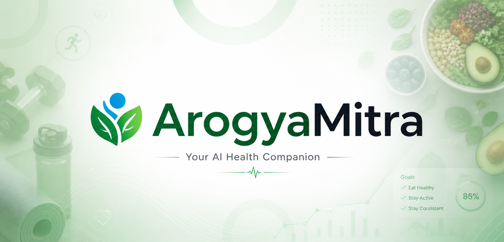
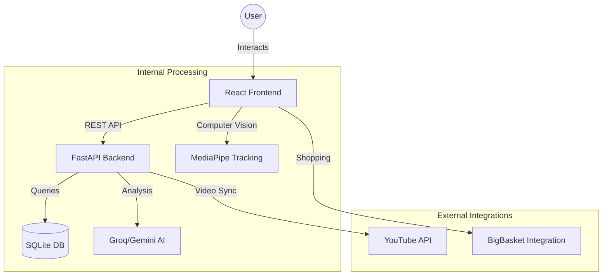

<p align="center">
  
</p>

# <p align="center">Arogya Mitra</p>

<p align="center">
  <strong>Your High-Performance AI Health & Fitness Companion</strong>
</p>

---

## 📝 Project Overview
**Arogya Mitra** is a comprehensive health-tech platform that leverages advanced AI to provide personalized fitness and nutrition architecture. From real-time camera tracking for exercises to deep-learning-based nutrition plans, Arogya Mitra is designed to be your all-in-one health synchronization hub.

---

## 🧬 System Architecture


---

## 🛠️ Technology Stack

| Component | Technology | Description |
| :--- | :--- | :--- |
| **Frontend** | React.js | Core UI library. |
| **Backend** | Python / FastAPI | Asynchronous high-performance API. |
| **Database** | SQLite | Relational data persistence. |
| **AI Engine** | Groq / Google Gemini | Powering AROMI Coach & Plan Generation. |
| **Vision Tracking** | MediaPipe | Real-time exercise rep counting. |

---

## 📡 API Reference (Unified Table)

| Module | Method | Endpoint | Description |
| :--- | :--- | :--- | :--- |
| **Auth** | `POST` | `/auth/register` | Register a new account. |
| **Auth** | `POST` | `/auth/login` | Authenticate & get session. |
| **Health** | `POST` | `/health/assessment` | Submit physiological data. |
| **Health** | `GET` | `/health/profile` | Retrieve user health stats. |
| **Health** | `POST` | `/health/profile/update` | Update user metrics. |
| **Health** | `POST` | `/health/reset` | Clear all account data. |
| **Workout** | `POST` | `/workout/generate` | Create AI workout plan. |
| **Workout** | `GET` | `/workout/current` | Get active workout plan. |
| **Nutrition** | `POST` | `/nutrition/generate` | Create AI nutrition plan. |
| **Nutrition** | `GET` | `/nutrition/current` | Get active nutrition plan. |
| **Progress** | `GET` | `/progress/stats` | Retrieve activity logs. |
| **Progress** | `POST` | `/progress/update` | Log exercise or meal. |
| **AI Coach** | `POST` | `/aromi/chat` | Chat with AROMI AI. |

---

## ⚙️ Environment Variables

| Variable | Default Value | Description |
| :--- | :--- | :--- |
| `GROQ_API_KEY` | `Required` | API Key for AI generation services. |
| `YOUTUBE_API_KEY` | `Optional` | API Key for workout video fetching. |
| `JWT_SECRET_KEY` | `Generated` | Secret key for token encryption. |
| `JWT_ALGORITHM` | `HS256` | Hashing algorithm for auth tokens. |

---

## 🚀 Getting Started

### Backend
```bash
cd backend
python -m venv venv
source venv/bin/activate
pip install -r requirements.txt
uvicorn main:app --reload
```

### Frontend
```bash
cd frontend
npm install
npm start
```