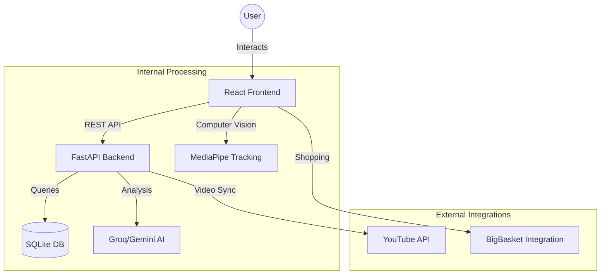
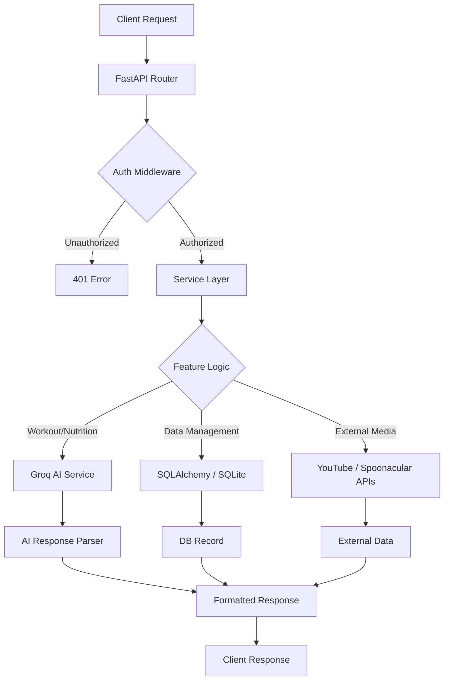
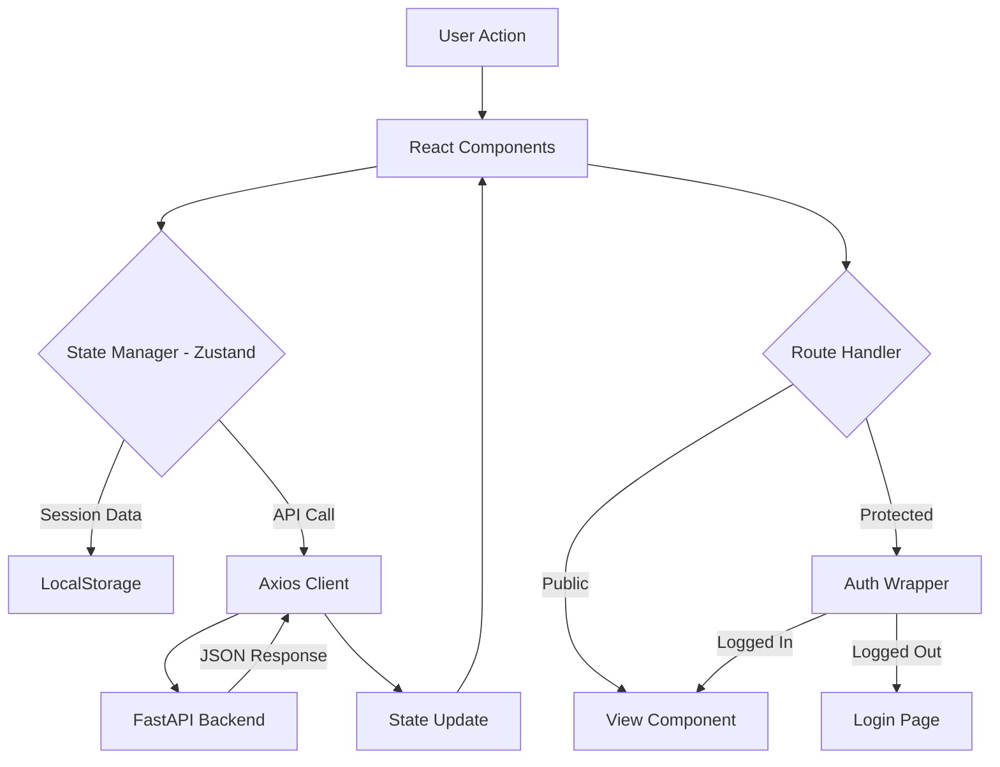
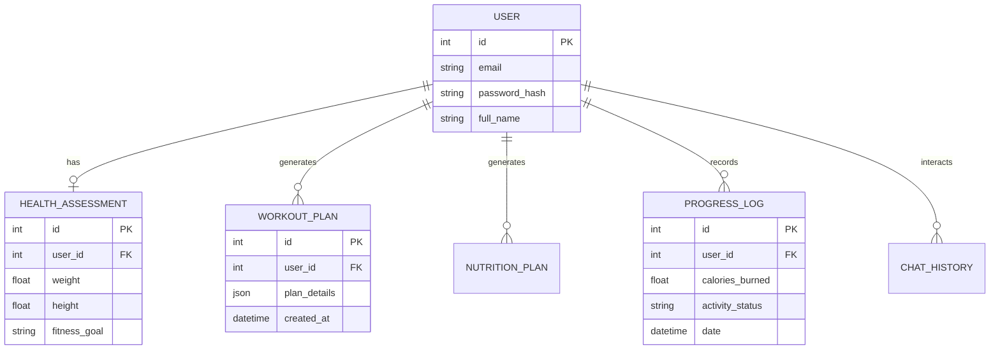
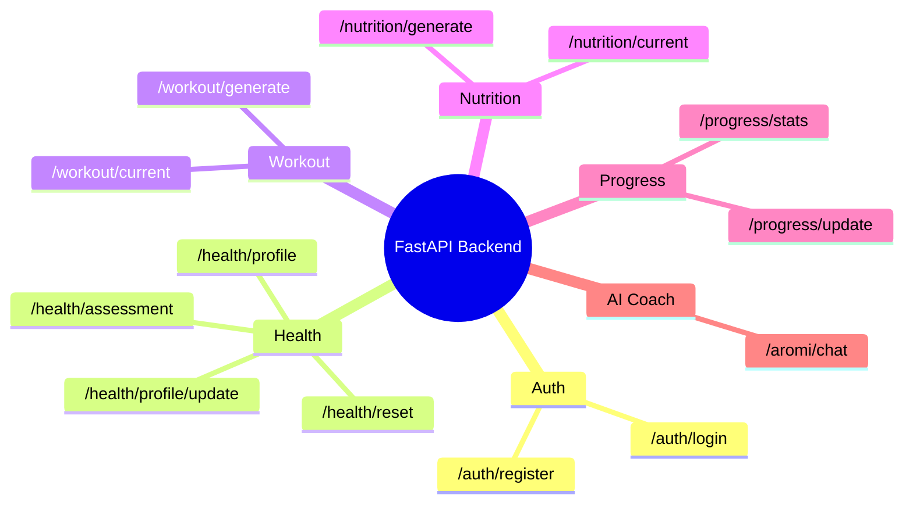

## System Architecture

```mermaid
graph TD
    User((User)) -->|Interacts| ReactApp[React Frontend]
    ReactApp -->|REST API| FastAPI[FastAPI Backend]
    
    subgraph "Internal Processing"
        FastAPI -->|Queries| SQLite[(SQLite DB)]
        FastAPI -->|Analysis| Groq[Groq/Gemini AI]
        ReactApp -->|Computer Vision| MediaPipe[MediaPipe Tracking]
    end
    
    subgraph "External Integrations"
        FastAPI -->|Video Sync| YouTube[YouTube API]
        ReactApp -->|Shopping| BigBasket[BigBasket Integration]
    end
```

---

## Backend System Flow

```mermaid
graph TD
    A[Client Request] --> B[FastAPI Router]
    B --> C{Auth Middleware}
    C -->|Unauthorized| D[401 Error]
    C -->|Authorized| E[Service Layer]
    
    E --> F{Feature Logic}
    
    F -->|Workout/Nutrition| G[Groq AI Service]
    F -->|Data Management| H[SQLAlchemy / SQLite]
    F -->|External Media| I[YouTube / Spoonacular APIs]
    
    G --> J[AI Response Parser]
    J --> K[Formatted Response]
    
    H --> L[DB Record]
    L --> K
    
    I --> M[External Data]
    M --> K
    
    K --> N[Client Response]
```

---

## Frontend System Flow

```mermaid
graph TD
    A[User Action] --> B[React Components]
    B --> C{State Manager - Zustand}
    
    C -->|Session Data| D[LocalStorage]
    C -->|API Call| E[Axios Client]
    
    E --> F[FastAPI Backend]
    F -->|JSON Response| E
    
    E --> G[State Update]
    G --> B
    
    B --> H{Route Handler}
    H -->|Protected| I[Auth Wrapper]
    H -->|Public| J[View Component]
    
    I -->|Logged In| J
    I -->|Logged Out| K[Login Page]
```

---

## Database Relationship Diagram (ERD)

```mermaid
erDiagram
    USER ||--o| HEALTH_ASSESSMENT : "has"
    USER ||--o{ WORKOUT_PLAN : "generates"
    USER ||--o{ NUTRITION_PLAN : "generates"
    USER ||--o{ PROGRESS_LOG : "records"
    USER ||--o{ CHAT_HISTORY : "interacts"

    USER {
        int id PK
        string email
        string password_hash
        string full_name
    }

    HEALTH_ASSESSMENT {
        int id PK
        int user_id FK
        float weight
        float height
        string fitness_goal
    }

    WORKOUT_PLAN {
        int id PK
        int user_id FK
        json plan_details
        datetime created_at
    }

    PROGRESS_LOG {
        int id PK
        int user_id FK
        float calories_burned
        string activity_status
        datetime date
    }
```

---

## Backend API Endpoints 

```mermaid
mindmap
  root((FastAPI Backend))
    Auth
      /auth/register
      /auth/login
    Health
      /health/assessment
      /health/profile
      /health/profile/update
      /health/reset
    Workout
      /workout/generate
      /workout/current
    Nutrition
      /nutrition/generate
      /nutrition/current
    Progress
      /progress/stats
      /progress/update
    AI Coach
      /aromi/chat
```